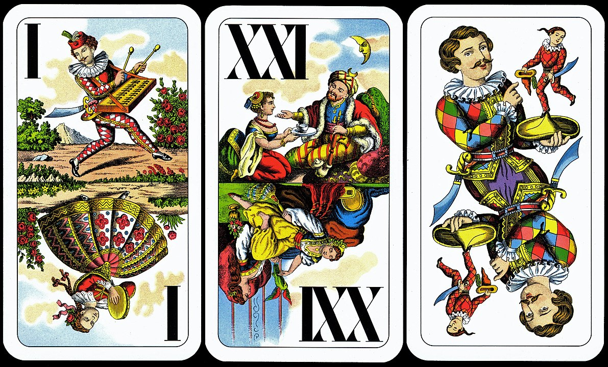

[![MIT License][license-shield]][license-url]

# Tarot Reader

## Description 
The app can do:
- a three card tarot draw
- a one card yes/no question tarot draw
- or, the user can explore the different cards

## Images
View Example Asset:

## Installation 
If all files are kept in a single folder a web browser should be able to run the project.

## Usage 
The user has three options.
  1.  Past, Present, Future: The app randomly draws 3 cards and displays them for the user.  The first card is assigned to the past, the second to the present, and the third to the future.  The app then displays a guide on how the user can interpret the cards.

  2.  Yes/No Question:  The user is prompted to enter a yes or no question in the text field.  This is just to keep a record of what they meant to ask the tarot and keep them honest, it doesn't factor into the draw at all.  When the user enters their question and hits submit, a card is randomly drawn from the deck and displayed along with a guide to interpretation.

  3.  Explore the Tarot: The user can explore the different arcana and click on the cards to learn more about them.

## Credits 
Fisher-Yates shuffle function taken from https://frankmitchell.org/2015/01/fisher-yates/

fog background from https://codepen.io/camstephensdomo/pen/PVqpaP